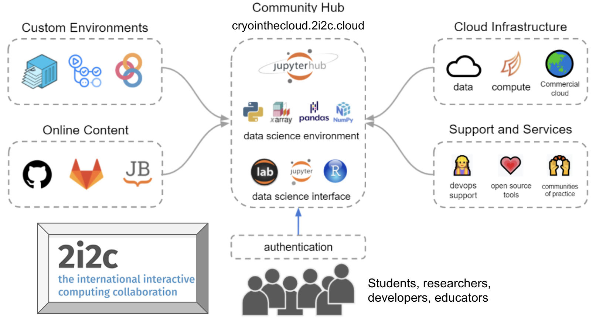

# About

Science is not composed of isolated groups of practitioners, but is rather an interconnected network of communities of practice, with members who fluidly move between them. Infrastructure for scientific research and collaboration should leverage this structure to make science more productive and inclusive. NASA (along with many other scientific entities) has started to adopt practices consistent with this natural structure of contemporary science. Communities such as [Project Jupyter](https://jupyter.org/) and [Pangeo](https://pangeo.io/) have pioneered a model for the inclusive, interconnected, and data-intensive practices of the future through cloud-based JupyterHub workflows. However, substantial barriers exist for individual users to make the transition from their local systems to the cloud to accomplish research goals: cloud cost opacity, infrastructure deployment complexity, and a general lack of community awareness and expertise, among others. At its outset, CryoCloud overcame these barriers by building upon existing cloud-workflow models and creating infrastructure that allows researchers to seamlessly move their workflows wherever they can do their best work.

CryoCloud is not just a cloud platform—it’s a **community-driven initiative** that brings scientists, developers, and data providers together. By working collaboratively with accessible tools and workflows, we empower researchers to reimagine how they analyze and share data. 

---
## Changing the Scientific Paradigm through Co-Creation

The success of CryoCloud is rooted in **co-creation** across our foundational partnerships. Co-creation refers to the collaborative dynamics enabled by a community's shared infrastructure and the rapid feedback loops we can close through *end-to-end transparency*, *intellectual generosity*, and *community agency* over a shared platform. This approach empowers users and developers alike to actively shape tools, infrastructure, and workflows that best meet their needs.

CryoCloud thrives through partnerships with innovative organizations and contributors:

- **[2i2c](https://2i2c.org/)**: Experts in open-source infrastructure who provide operational support for JupyterHubs and cloud-native tools. They ensure that the platform is reliable, scalable, and tailored to the needs of the geoscience community.
- **Community Tool Developers**: Designers of open-source software and tooling who work collaboratively to simplify geoscience workflows and ensure their tools are interoperable and user-friendly.
- **Geoscience Communities**: Scientists, data producers, and engineers working collaboratively to tackle critical geoscience challenges.

Through co-creation, these partnerships align cutting-edge infrastructure with the needs of researchers, ensuring that our tools and training programs have real-world impact.

 

### A Structured Approach to Community Collaboration with 2i2c

Our community cloud-ecosystem leverages a structured partnership between CryoCloud representatives and [2i2c](https://2i2c.org/). Together, the team co-creates:
- Solutions to cloud issues and infrastructure needs.
- Content to guide users in adopting cloud-based tools and workflows.
- Infrastructure management best practices** that evolve to meet community requirements.

CryoCloud representatives act as bridges between users and 2i2c, ensuring that community goals and dynamics are reflected in platform design and training resources. Meanwhile, 2i2c operates and develops the community-specific cloud infrastructure, improves the open-source tools powering the ecosystem, and supports researchers in their use of these tools. As leading experts in open-source standards, 2i2c ensures that all advancements and lessons learned are rapidly and openly shared across not just the CryoCloud community and all 2i2c hubs, but also the upstream Jupyter and broader open-source communities, expanding our impact. 

 

### Driving Innovation with Tool Developers

Our partnerships with tool development projects such as [icepyx](https://icepyx.readthedocs.io/), [earthaccess](https://earthaccess.readthedocs.io/), and [sliderule](https://slideruleearth.io/) exemplify how co-creation benefits both developers and users:

- **Collaborative Environment**: Developers and users share the same Slack channels and infrastructure, creating an open and direct communication pipeline. This means users get the best answers to their tooling questions directly from developers.
- **Active Feedback**: Tool developers receive immediate feedback on bugs, feature requests, and usability issues, enabling them to actively improve their tools. This feedback loop fosters continuous iteration and refinement.
- **Interoperability Through Co-Creation**: Developers collaborate across projects to make their tools interoperable. This ensures that users can seamlessly integrate multiple tools into their workflows, saving time and enhancing efficiency.

By embedding tool development within the community, CryoCloud ensures that both developers and users benefit from shared insights, fostering a culture of collaboration and innovation.

 

### Transforming Research and Education

The CryoCloud research community serves as a model for developing training and tools that accelerate the transition to cloud-based workflows across geoscience disciplines. This transition delivers real-world benefits, including:

- **Broadened Accessibility**: We can get a new intern working on an entire NASA data store in an afternoon. We can do so because we minimize the learning curve by providing effective training, transferable code and workflows, and intuitive and stable computing infrastructure, 
- **Faster Workflows**: Code implementations that reduce dataset read-ins and compute times by as much as two orders of magnitude mean lower cloud costs, fewer work hours, and more time to iterate on solutions.
- **Cost Efficiency**: Scalable tools and workflows that make advanced scientific computing available to all.

By embracing co-creation and leveraging shared resources, CryoCloud is making scientific computing more **intuitive**, **cost-effective**, and **open for all**.

---

## What CryoCloud Provides

### **Collaborative Community of Generosity**
CryoCloud first and foremost helps to connect researchers and build community by providing: 
- Open Slack workspace with rapid response times to directly connect researchers, tool developers, and cloud engineers.
- A GitHub organization that welcomes contribution and provides transparency in our content and infrastructure development.
- Knowledge sharing and access to the latest tooling and workflows that enable collaboration.

### **Equitable Access to Resources**
CryoCloud provides free access to cloud computing resources for verified geoscientists brought in through our workshops, including:
- Scalable JupyterHub instances with up to 32 GB of RAM and NVIDIA GPUs.
- The ability to bring your own cloud credits for larger-scale computations.
- [Soon] Long-term storage support for derived datasets through collaboration with Radiant Earth.

### **Streamlined Workflows**
CryoCloud enables researchers to:
- Process and analyze large datasets with minimal setup.
- Share workflows, tools, and insights in open, collaborative spaces.
- Reduce compute times and costs through efficient resource allocation.

### **Accelerated Learning**
CryoCloud hosts workshops, hackathons, and training sessions designed to:
- Build cloud computing and open science skills for users of all experience levels.
- Include participants from diverse backgrounds and institutions.
- Foster collaboration and knowledge-sharing across geoscience disciplines.

---

## A Vision for the Future

CryoCloud aims to support the next generation of geoscience research by creating a culture of **openness**, **collaboration**, and **innovation**. Our work supports researchers in achieving their goals while inspiring new tools and approaches that advance Earth science as a whole.

With CryoCloud, geoscientists can focus on what matters most: making discoveries that drive progress and understanding.
