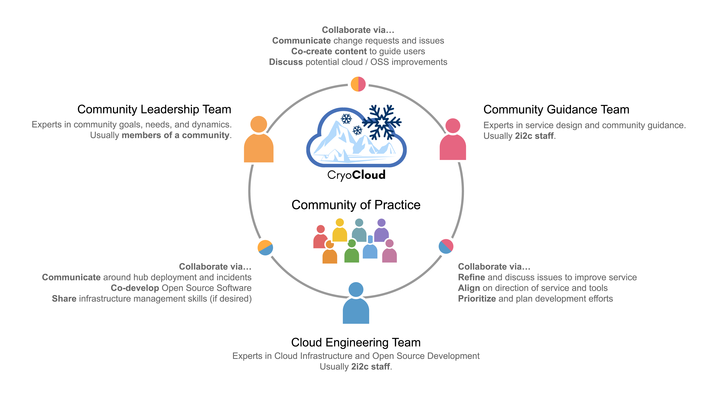

# Mission

## CryoCloud to accelerate discovery and enhance collaboration

CryoCloud is dedicated to helping researchers transition to cloud-based collaboration and processing under the supervision of dedicated developers and in a managed environment that meets the community needs.

A community of practice is a collaborative model that shows how we can tailor infrastructure with community input to meet the specific needs of current and future scientists.

The collaborative, interdisciplinary approach between [2i2c](2i2c.org) engineering experts and the [NASA Cryosphere](https://ice.nasa.gov/) community is critical to understanding the large-scale effects of climate change in the cryosphere and willlead to better data management, code sharing, and collaborative research projects across the community to address current challenges.

Everyone involved in CryoCloud, from scientists to software developers, commit to our **[Code of Conduct](Code_of_Conduct)**.
