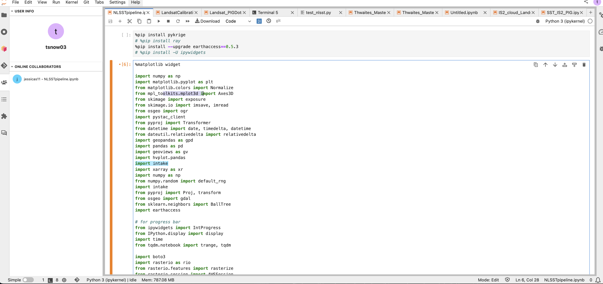

# Jupyter Collaboration

## Overview

[Jupyter-collaboration](https://jupyterlab-realtime-collaboration.readthedocs.io/en/latest/) Jupyter extension allows co-coding functionality similar to how GoogleDocs works. It is called Real-Time Collaboration (RTC) and is synchronous only: your collaborators will only be able to code in your document if you have the same document open in RTC mode in your server.

## Activate jupyter-collaboration in CryoCloud

There are two options you can take for turning co-coding capabilities on for the times when you would like to co-code with others:

1.  [Best] When starting up your server, select Other from the Image Selector and add this tag to the Custom Image box:

```python
quay.io/cryointhecloud/cryo-hub-image:8f0fe899975c
```

2. [Can be buggier] Or if you already have your server running
   - Click on the puzzle piece button on the left side of the JupyterHub screen to open the extension manager
   - Search for `collaboration`
   - Click `Install` for `jupyter-collaboration`
   - You will be prompted to press the page refresh button to be able to use the new installation


## Ensuring RTC mode is on for your notebook


With RTC mode (`jupyter-collaboration`) turned on, you will notice a circle with your initial at the top right of the JupyterHub (similar to GoogleDocs) with a prong thing button (the technical term) just to the left of it. 

Once `jupyter-collaboration` is installed, you will notice the notebook `Save` button and ability to press `Save` in the `File` dropdown are **disabled** (grayed out). This is because the notebooks automatically save when you make changes or close the notebook and pressing save is unnecessary (similar to GoogleDocs). But it feels a little unnerving at first so feel free to try typing a word, closing and clicking `discard changes` if it pops up, and see if you lost anything when you reopen. You won't. 

If the `Save` button is not grayed out, your notebook is not yet in RTC mode. This can happen if you have notebooks already open that were not last saved in a session with `jupyter-collaboration` enabled, you will want to close and re-open the notebook. The `Save` button will be gray now, indicating RTC is enabled for this notebook and instant autosaving has begun.


 


## To start collaborating


Click on the prong button in the top right of your JupyterHub window to produce a link that you can give to others to join your current JupyterHub session for co-coding on the notebook you that is currently open for you. If RTC is enabled for your current notebook, the link will have `RTC%3A` before the path to your notebook file, like this:

```python
https://hub.cryointhecloud.com/user/tsnow03/lab/tree/RTC%3AUntitled1.ipynb
```

If `RTC%3A` is missing, your `Save` button is probably not grayed out and you aren't in RTC mode for your notebook. You will need to close the notebook and reopen. 

Your collaborator can now use the link to open your current notebook and you will both instantly see each other's changes and cursors.

```{note}
An RTC link works with only one notebook. You will need to send a different link to collaborate on another file.
```

Make sure to `Stop Server` before logging out to immediately end the other person's ability to keep working on your file.


## Critical notes


**RTC is only synchronous.** When you shut down your server (logging out on its own doesn't shut down your server), your collaborator will be kicked out and will not be able to reuse the link. However, if you don't fully shut down your server and just leave or log out, your collaborator will be able to continue coding on your notebook until your server shuts down from inactivity.

The **RTC link for a notebook never changes between sessions.** Hypothetically if you open your notebook another day in RTC-mode and your collaborator uses a previous link you've given to them (or knows the path to the notebook), they will be able to access the notebook with the same link. This will only be able to happen if you have the notebook open and in RTC-mode, but still creates **a potential security risk**. You will at least still be able to see that the person has joined you and where they are working.

If you are having problems where you've provided a link but the work your collaborator is doing on your notebook isn't immediately showing for you, you may be using a notebook that doesn't have RTC (real-time collaboration enabled) enabled. Follow `To start collaborating` above and recopy the link to fix.

Coming soon: Can non-CryoCloud collaborators use an RTC link?
