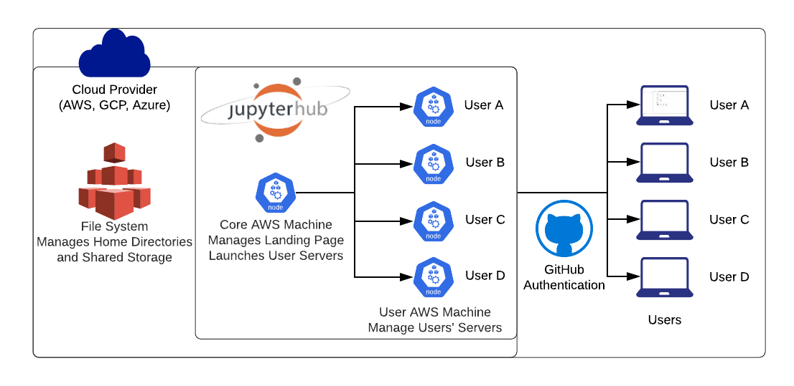
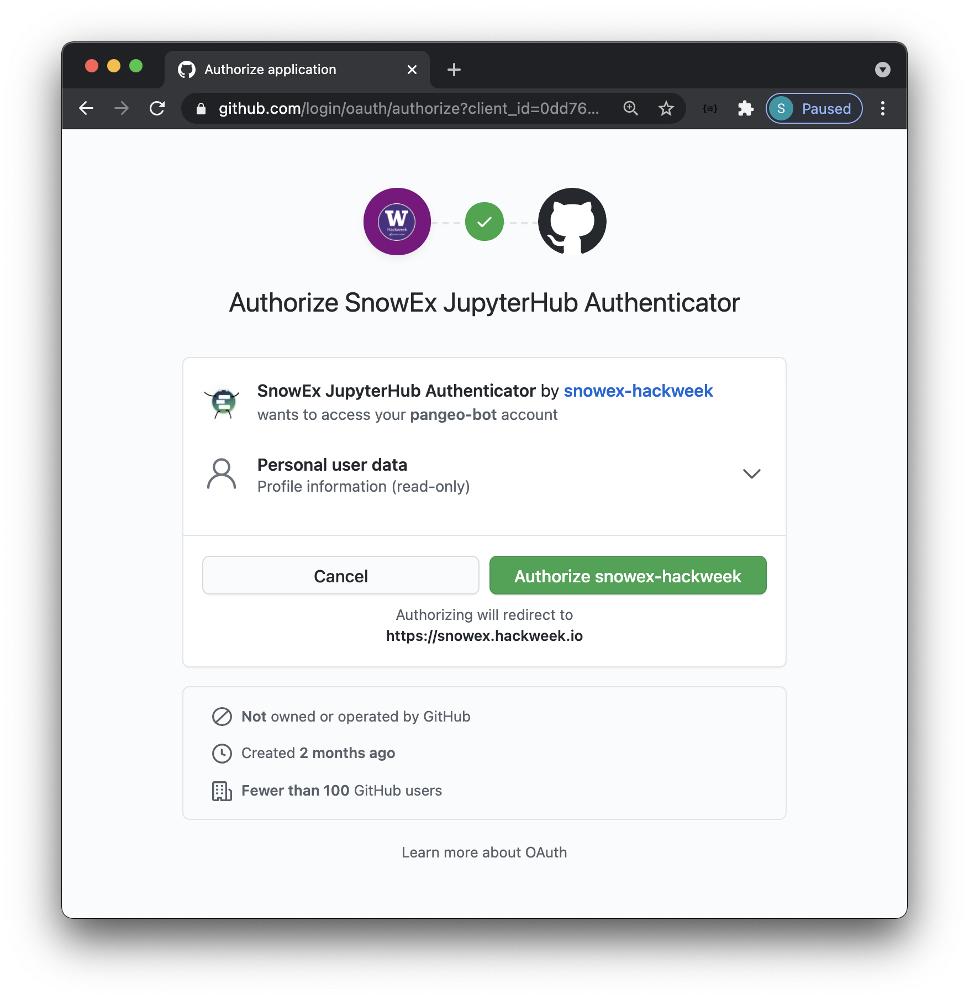
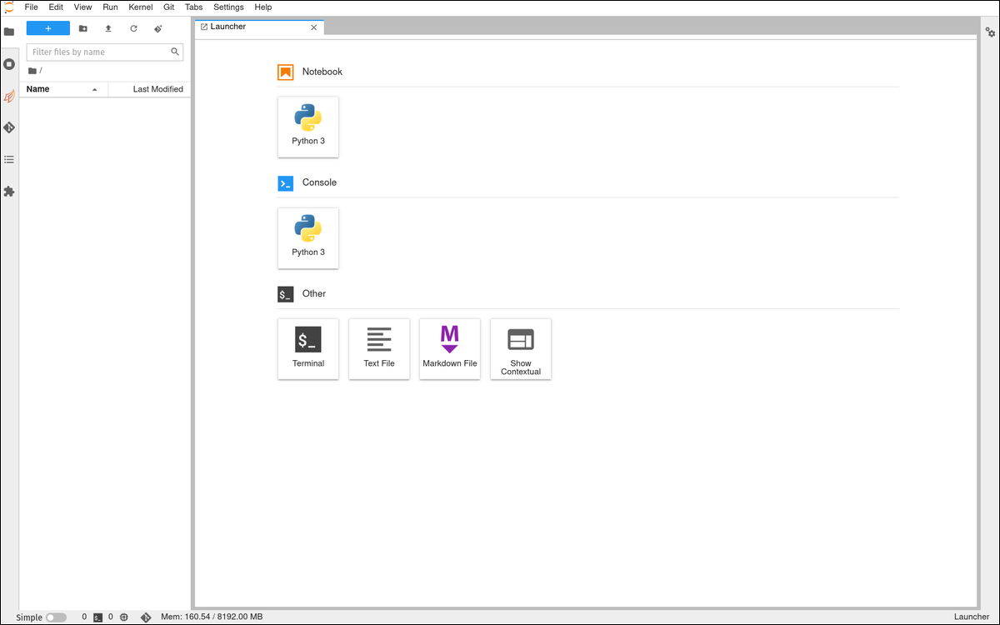
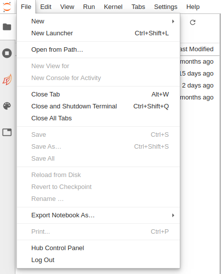

# JupyterHub

(event-jupyterhub)=
## Why are we using a shared cloud environment?

We use {term}`JupyterHub` in an educational setting because it enables us to quickly begin working with code. Each participant connects to a computational environment hosted in the cloud. All that is required is a web browser, and a GitHub username for authentication:



We encourage you to use these shared cloud environments for all the tutorials, and you can optionally use this for your projects as well.

(accessing-jupyterhub)=
## How do I access the shared cloud environment?

Access to our shared cloud environment (JupyterHub) is under this URL: {{ jupyterhub_url }}!

### First time login

```{attention}
Before going to {{ jupyterhub_url }} you need to setup your {{ hackweek }}
organization membership correctly. See: {ref}`configure-github`
```

The first time you sign in, you will be asked to authorize the OAuth app as access
to the JupyterHub is restricted to {{ hackweek }} GitHub Organization members.

```{note}
The screenshots below will not exactly match what you see and you should see your
user information for instance.
```



### After each login

```{attention}
It can take several minutes for new servers to launch on the cloud - be patient!
Once things are spun up you will see your very own instance of a {term}`JupyterLab` environment
```



When you log into JupyterHub you have access to your own virtual drive space
under the `/home/jovyan` directory. No other users will be able to see or access
your data files. You can add/remove/edit files in your virtual drive space.


### How do I end my JupyterHub session?

Stopping the server happens automatically when you navigate to "File -> Log Out"
and click "Log Out"! to end a session. You can also select "File -> Hub Control
Panel -> Stop my Server".



```{attention}
When you are finished working for the day it is important to explicitly log
out of your JupyterHub session.
```

The reason for this is it will save us a bit of money! When you keep a session
active it uses up AWS resources and keeps a series of virtual machines deployed.

###  Will I lose all of my work?

Logging out will **NOT** cause any files under `/home/jovyan` to be deleted. It
is equivalent to turning off your desktop computer at the end of the day.
