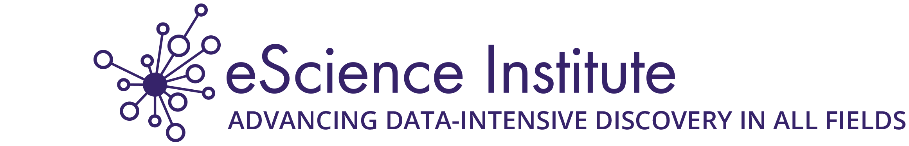

# Welcome to {{hackweek}}!




```{note}
{{hackweek}} will be offered virtually March 21 - 25. The purpose of the event is to coalesce people and resources around exploring, creating, and promoting effective computation and analysis workflows that utilize NASA's ICESat-2 mission.
```

📖 On this JupyterBook website you'll find [tutorials](tutorials/index). All tutorials are Jupyter Notebooks, designed to be run interactively, but also rendered on this website for convenience.

👩‍💻 Teams work collaboratively on different projects. Read more about the projects and results on our [projects page](projects/list_of_projects)

💡 Learn more about hackweeks hosted by the [University of Washington eScience Institute](https://uwhackweek.github.io/hackweeks-as-a-service/intro.html), or check out our publication describing the hackweek educational model {cite:p}`Huppenkothen2018`.

For the recommended citation for the content on this website see our Zenodo record:
[](https://zenodo.org/badge/latestdoi/452775913)

```{admonition} Quick links for the event
:class: seealso
* JupyterHub: {{ jupyterhub_url }}
* GitHub organization: {{ github_org_url}}
```
