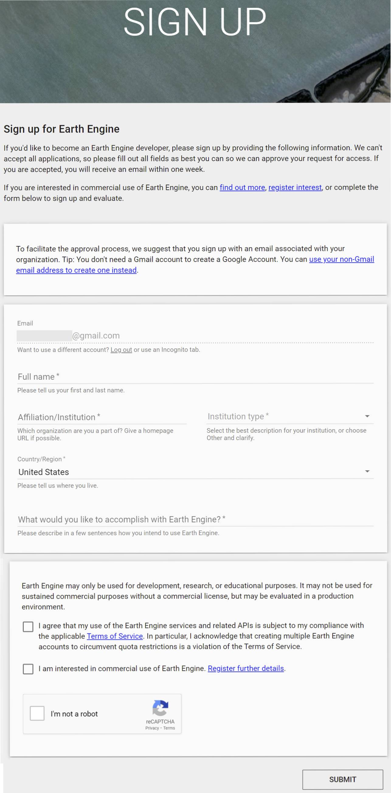

# Google Earth Engine Sign-Up

## Overview

[Google Earth Engine](https://earthengine.google.com/) (GEE) combines a multi-petabyte catalog of satellite imagery and geospatial raster datasets with planetary-scale analysis capabilities. It provides an easy, unified way to query for raster data that can help you put ICESat-2 data into context. Earth Engine is available for commercial use, but remains free for academic and research use.

## Do I need to register for a Google Earth Engine account?

The ICESat-2 visualization tutorial will have an interactive component that uses GEE to query for additional data that can help you put your ICESat-2 data into context. 
If you would like to follow this part of the tutorial interactively, you will need to have registered for an account so that you can authenticate GEE. 

## Registering for an Earth Engine account

* Go the the [GEE sign up page](https://signup.earthengine.google.com/) and enter the email you want to use for your GEE account. A gmail - or an institutional address with an associated google account - is best if you have one.
* Enter your email, your affiliation and country/region. Where it asks what you want to accomplish, mention you are at ICESat-2 Hackweek at the University of Washington.
* Review the terms, verify your non-robot identify and click ‘Submit’.
* Check your email, including your spam folder, for a link from the Google Developer’s Team. The confirmation email will have directions on how to access the Code Editor.
* Not sure if you have access? Use [this link](https://code.earthengine.google.com/) to check. If you didn’t get access you will get an authorization error that says your account isn’t registered. If you do have access, the link will open up the Javascript IDE. This link is your permanent portal to GEE access.

