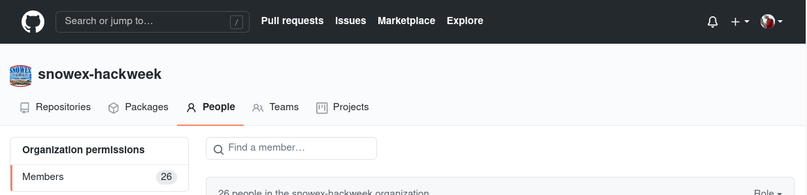

# GitHub

## What is GitHub?
[GitHub](https://github.com) is a hosting service for {term}`Git` repositories,
enabling us to share code across teams in a web environment.

## Why do I need a GitHub account?

There are three reasons you are required to have a GitHub account for the hackweek:

1. Your GitHub accounts will give you access to the hackweek cloud computing resources
2. All hackweek tutorials will be shared on GitHub
3. All project teams will use GitHub to collaborate and work together on their code

## Creating a GitHub account

Go to [GitHub](https://github.com/).


Next, enter your email address and click on the green 'Sing up for GitHub' button.
You will need to answer a few required questions in the following dialogs.
Be sure to save your password somewhere safe because you will need it later!

## Why are you joining the a Hackweek GitHub Organization?

GitHub organizations are a way for teams to manage many repositories
specific to a project or workshop in one place. For the hackweek, having
an organization creates a central location to access all hackweek content.
GitHub organizations also have 'teams' that offer simple ways to provide repository
access to groups of people, rather than individuals.

We have created a {{ hackweek }} GitHub organization ({{ github_org_url}}).
For security purposes you can only join the organization by invitation.
Here are the steps:

1. If you confirmed participation in the hackweek you will receive an email notification to the email you provided when you signed up for GitHub.
1. Follow the link in the email to accept the invitation.

(configure-github)=

## How should I configure my GitHub account?

As you'll learn in the next lesson, we will use the {{ hackweek }} GitHub
organization as a way to manage access to our cloud computing resources.

```{attention}
You must have *Public*, rather than *Private* organization membership (GitHub's default),
in order for our JupyterHub authentication to work. For events like hackweeks,
public membership also helps so that others can recognize your participation in the event!
```

First, navigate to the "People" tab on the {{ hackweek }} GitHub organization
({{ github_org_url }}) and find yourself:



Now, if you see "Private" to the right of your account, you will need to switch this to "Public":


The steps for doing this are also well documented on [this](https://help.github.com/en/articles/publicizing-or-hiding-organization-membership) GitHub help page.

## How will GitHub repositories be structured?

When you click on the "Repositories" tab in the {{ '[GitHub organization]({url})'.format(url=github_org_url) }}  you will see a list of names, each of which links to a separate GitHub repository:


Each repository is a container for a specific subset of material for this event. For example, there is a repository for the public-facing website you used to register for this event {{website_url}}. We'll also create new repositories for each project.
