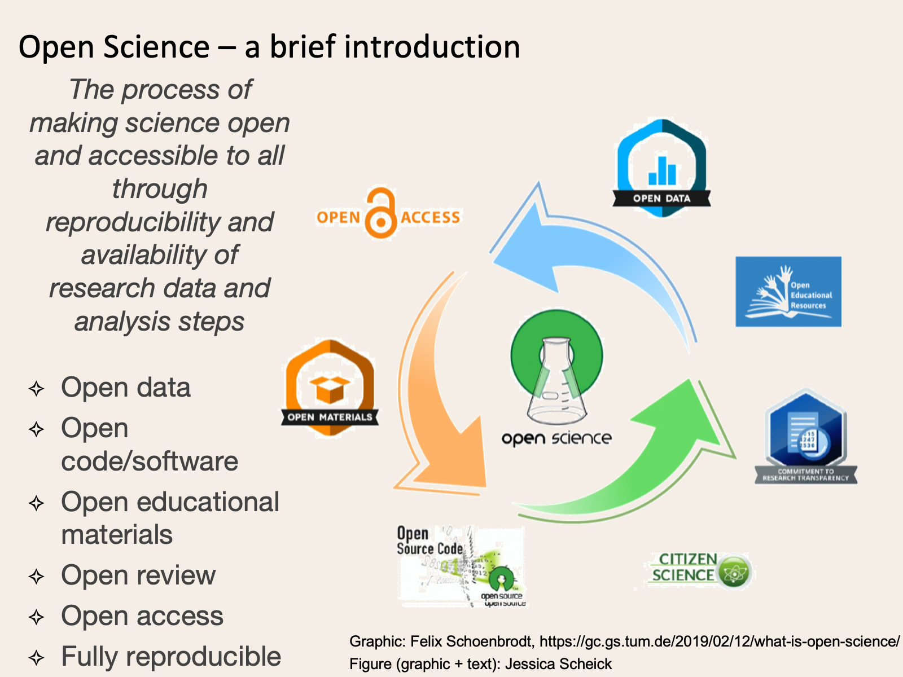

# Open Science

## What is Open Science?

Open science is the process of making science open and accessible to all through reproducibility and availability of research data and analysis steps.
Practicing open science allows you to get critical feedback throughout the process, rather than just towards the end of a project.
Plus, by sharing our work, we can ask increasingly complex questions.

Please note, this list is definitely not exhaustive, but is meant as a starting place and guide for good sources of additional information.

## Open Science Communities and Organizations
These organizations and communities are dedicated to creating, teaching, and sharing the tools, skills, and resources necessary for making all science open science.
**Note: some resources are included in both lists if they have resources specifically targeted at technical skill development**

- [The Turing Way](https://the-turing-way.netlify.app/welcome.html)
  - Keywords: GitHub; tutorials; guides; reproducible; collaborative; data science; contribute; development; open-source; git
  - “The Turing Way is an open source community-driven guide to reproducible, ethical, inclusive and collaborative data science.”
  - “Our goal is to provide all the information that data scientists in academia, industry, government and the third sector need at the start of their projects to ensure that they are easy to reproduce and reuse at the end.”
- [The Center for Scientific Collaboration and Community Engagement (CSCCE)](https://www.cscce.org/)
  - Keywords: community; sharing; recognition; fellowships; workshops; resources
  - “The Center for Scientific Collaboration and Community Engagement (CSCCE) is a research and training center to support and study the merging field of scientific community engagement.”
  - Lots of great \[open\] resources for exploring and cultivating community, including evaluation materials and onboarding resources (e.g. a number of beginner user guides for platforms like Slack)
- [Openscapes](https://www.openscapes.org/)
  - Keywords: community; education; reproducibility; sharing; collaborative; data science; efficiency; mentoring
  - Openscapes “\[champions\] open practices in environmental science to help uncover data-driven solutions faster.”
  - Currently (May 2021) working directly with NASA DAACs
- [The Center for Open Science (COS)](https://www.cos.io/)
  - Keywords: community; badges; community; sharing; tracking; recognition; open science; open research
  - Organization promoting open science
- [Software Sustainability Institute](https://software.ac.uk/)
  - Keywords: tutorials; workshops; fellowships; reproducible; sustainable software
  - UK-based institute cultivating “better, more sustainable, research software to enable world-class research.”
  - “We help people build better software, and we work with researchers, developers, funders and infrastructure providers to identify key issues and best practice in scientific software.”
- [Better Scientific Software (BSSw)](https://bssw.io/)
  - Keywords: fellowships; community
  - “BSSw provides a central hub for the community to address pressing challenges in software productivity, quality, and sustainability.”
- [Earth Science Information Partnership (ESIP)](https://www.esipfed.org/)
  - Keywords: community; fellowships; resources; conferences
  - US-based partnership for sharing and promoting open science, including standards development and advocacy, for earth science data. One of the most interactive conferences I’ve ever attended!
    
