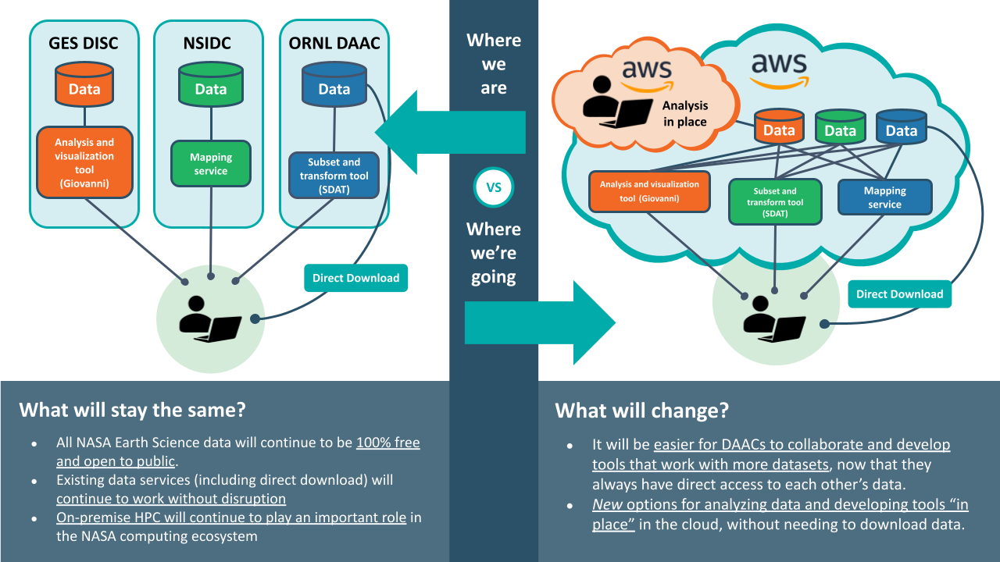
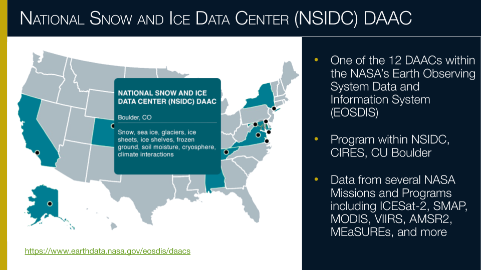
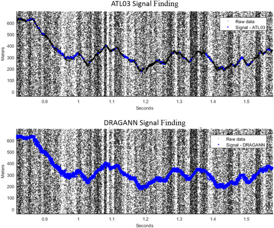

# Introduction to NASA Earthdata Cloud and ICESat-2

### Learning Outcomes

The purpose of this overview is to introduce the data search and access options provided within the Earthdata Cloud, along with an introduction to NASA's ICESat-2 Mission. 

### Prerequisites

None

### Credits

This guide was adapted from the following tutorials:
* [Data Discovery and Access: Overview](https://icesat-2-2023.hackweek.io/tutorials/data-access-and-format/overview.html) by Andy Barrett, NSIDC DAAC
* [Using icepyx to access ICESat-2 data](https://nasa-openscapes.github.io/2023-ssc/tutorials/data-access/icepyx.html) by Rachel Wegener, University of Maryland
* [Data Strategies for Future Us](https://nsidc.github.io/data_strategies_for_future_us/data_strategies_slides#/workflow-solutions-3) by Andy Barrett, NSIDC DAAC
* [Accessing and working with ICESat-2 data in the cloud](https://nasa-openscapes.github.io/2023-ssc/tutorials/data-access/) by Rachel Wegener, University of Maryland; Luis Lopez, NSIDC DAAC; and Amy Steiker, NSIDC DAAC.

## 1. Modes of Data Access

In the past, most of our scientific data analysis workflows have started with searching for data and then downloading that data to a local machine; whether that is the hard drive of your laptop or workstation, or some shared storage device hosted by your institution or research group. This can be a time consuming process if the volume of data is large, even with fast internet. It also requires that you have sufficient disk-space and update your copy every time an updated version of the data is released. If you want to work with data from different geoscience domains, you may have to download data from several data centers. 



<figure>
<center>
    
</center>
</figure>

Figure credit: Alexey Shiklomanov, NASA ESDIS Project Scientist, from [The future of NASA Earth Science in the commercial cloud:
Challenges and opportunities](https://docs.google.com/presentation/d/12mh_8WU9lsrPviBO_MBv2blbjRufXoQmqCB4XGyxQ90/edit?pli=1)

However, a change is a-foot. New modes of data access are becoming available. Driven by the growth in the volume of data from future satellite missions, the archiving and distribution of NASA data is in a [state of transition](https://www.earthdata.nasa.gov/eosdis/cloud-evolution). Over the next few years, all NASA data will be migrated to the NASA Earthdata Cloud, a cloud-hosted data store that will have all NASA datasets in one place. This not only offers new modes of accessing NASA data but also offers new ways of working with this data. As with Google Docs or Sheets, data in these "files" is not just stored in the cloud but compute resources offered by cloud providers allow you to process and analyze the data in the cloud. When you edit your Google Doc or Sheet, you are working in the cloud, not on your computer. All you need is a web browser; you can work with these files on your laptop, tablet or even your phone. If you choose to share these documents with others, they can actively collaborate with you on the same document also in the cloud. For large geoscience datasets, this means you can _skip the download_ and take your _analysis to the data_.  

## 2. NASA Earthdata Cloud

NASA's cloud-hosted storage is known as the Earthdata Cloud; all NASA datasets are being migrated to be available in the cloud. During this transition period, data will still remain freely available for download directly from the DAACs (Distributed Active Archive Centers), which have archived and distributed NASA data for over 20 years.

<figure>
<center>
    
</center>
</figure>

The NSIDC DAAC now offers all [ICESat-2](https://nsidc.org/data/icesat-2) and [ICESat/GLAS](https://nsidc.org/data/icesat) data products via Earthdata Cloud. A listing of all NSIDC DAAC cloud-hosted data can be found [here](https://nsidc.org/data/earthdata-cloud/data). More details on ICESat-2 below.

### Earthdata Cloud Computing Basics

"The Cloud" is a somewhat nebulous term (pun intended). In general, the cloud is a network of remote servers that run software and services that are accessed over the internet.  There is a growing number of commercial cloud providers (Google Cloud Services, Amazon Web Services, Microsoft Azure). NASA has contracted with Amazon Web Services (AWS) to host data using the AWS Simple Storage Service (S3). AWS offers a large number of services in addition to S3 storage. A key service is Amazon Elastic Compute Cloud (Amazon EC2). This is the service that is _under-the-hood_ of the CryoCloud JupyterHub you are using during today's workshop.  When you start a JupyterHub, an EC2 _instance_ is started.  You can think of an EC2 _instance_ as a remote computer.

AWS has the concept of a region, which is a cluster of data centers. These data centers house the servers that run S3 and EC2 instances. NASA Earthdata Cloud is hosted in the `us-west-2` region. This is important because if your EC2 instance is in the same region as the Earthdata Cloud S3 storage, you can access data in S3 directly in a way that is analogous to accessing a file on your laptop's or workstation's hard drive. This is one of the key advantages of working in the cloud; you can do analysis where the data is stored without having to download or move the data to another machine.  

### Cost Considerations

The notion of _analysis in place_, or the concept of bringing your compute, or processing, to the data, provides several advantages over the more traditional download method: You no longer need to move data from its archived location, and you only pay for the compute needed to do your analysis. A few key points about cost:

* Cost to access: As long as you are performing your processing in the same location (region) as where the data are located in Earthdata Cloud, then the cost to access the data is completely free. CryoCloud is running in the same `us-west-2` region as where the NASA Earthdata Cloud data are stored.
* Cost to compute: Just like your laptop costs money up front that provides you with certain CPU and memory, the compute resources needed to run your analyses do cost money. This can be thought of as the difference between an upfront cost like purchasing a laptop to process data locally versus something you can pay for as you go. There is a cost associated with the EC2 instance mentioned above, paid for by CryoCloud.
* Cost to store: With _analysis in place_, the data are being streamed directly from its native location in the cloud, so storage is not needed. However you may wish to store analysis outputs or other data using your own S3 bucket, which does incur a cost. 

### "When To Cloud"

Migrating to a cloud-based data analysis workflow can often have a steep learning curve and feel overwhelming. There are times when the cloud is effective and times when the download model may still be more appropriate. Here are a few key questions to ask yourself: 

* What is the data volume?
* How long will it take to download?
* Can you store all that data (cost and space)?
* Do you have the computing power for processing?
* Does your team need a common computing environment?
* Do you need to share data at each step or just an end product?


## 3. Introduction to ICESat-2


ICESat-2 carries a satellite lidar instrument, ATLAS. Lidar is an active remote sensing technique in which pulses of light are emitted and the return time is used to measure distance, in this case the height of something on the earth's surface. The available ICESat-2 data products range from sea ice freeboard to land elevation to cloud backscatter characteristics. A list of available products can be found [here](https://icesat-2.gsfc.nasa.gov/science/data-products). 


More key features of ICESat-2:

* Height determined using round-trip travel time of laser light (photon counting lidar)
* 10,000 laser pulses released per second, split into 3 weak/strong beam pairs at a wavelength of 532 nanometers (bright green on the visible spectrum).
* Measurements taken every 70 cm along the satellite’s ground track, roughly 11 m wide footprint.
* The number of photons that return to the telescope depends on surface reflectivity and cloud cover (which obscures ATLAS’s view of Earth). As such, the spatial resolution of signal photons varies.

### Data Collection

ICESat-2 measures data along 3 strong/weak beam pairs, resulting in 3 strong beams and 3 weak beams. The strong and weak beams are calibrated such that the weak beams have more sensitivity to viewing very bright surfaces (Ex. ice), while the strong beams are able to view surfaces with lower reflectances (Ex. water). The beams are designated in each data product as `gt1l`, `gt1r`, `gt2l`, `gt2r`, `gt3l`, and `gt3r`, where `gt` stands for "ground track", the number refers to the photon emitter, and the `l` and `r` indicate "left" or "right" beam of the pair. Which of these designations is strong or weak depends on the orientation of the satellite (forwards, `sc_orient==1`; backwards, `sc_orient==0`). A helpful table of which beams are strong/weak can be found on p131 of the [ATL03 Algorithm Theoretical Basis Document](https://icesat-2.gsfc.nasa.gov/sites/default/files/page_files/ICESat2_ATL03_ATBD_r006.pdf). The ATLAS spot number (values 1-6) is based on the ground track designation (`gt1l` etc.) and spacecraft orientation and, once determined, can be used to consistently identify strong (Spots 1, 3, and 5) and weak (Spots 2, 4, and 6) beams.


Photo: Neuenschwander et. al. 2019, Remote Sens. Env. [DOI](https://doi.org/10.1016/j.rse.2018.11.005)

### Counting Photons

The ICESat-2 lidar collects at the single photon level, different from most commercial lidar systems. A lot of additional photons get returned as solar background noise, and removing these unwanted photons is a key part of the algorithms that produce the higher level data products.



> _Fig. 2. Results from signal finding methods for simulated ATLAS data. Black points show raw point cloud data as ingested from ATL03 product. Blue points overlaid in each plot show which photons each method identified as signal. Top panel reflects the signal photons as identified on the ATL03 data product (medium and high confidence signal photons). Bottom panel reflects the signal photons identified from the ATL08 DRAGANN method._ (Neuenschwander & Pitts, 2019)

Photo: Neuenschwander et. al. 2019, Remote Sens. Env. [DOI](https://doi.org/10.1016/j.rse.2018.11.005)

To aggregate all these photons into more manegable chunks, many of the Level-3B products such as [ATL08](https://nsidc.org/data/atl08) consolidate the photons into variable segment lengths.


## 4. Navigating ICESat-2 Tool & Access options

There are many options across NASA Earthdata when it comes to search, access, visualization, and customization tools. The [Tools & Services Roadmap](https://nasa-openscapes.github.io/earthdata-cloud-cookbook/cheatsheets.html#tools-services-roadmap) cheatsheet as part of the NASA Openscapes Cookbook presents a high level view of some of these pathways. 

We will be highlighting a few tool and access options specifically for ICESat-2 today. This table provides an overview of the capabilities supported by `icepyx`, `earthaccess`, and SlideRule Earth. These open-source tools have been co-evolving through ongoing collaboration across our cryospheric open source software community. 

```{table} Data Access Method and Tools
:name: data-access-overview-table

|                                             | `icepyx` | `earthaccess` | NASA Earthdata Search | SlideRule Earth |
|---------------------------------------------|----------|---------------|-----------------------|-----------------|
| Filter spatially using:                     |          |               |                       |                 |
| - Interactive map widget                    |          | soon!         | x                     | x               |
| - Bounding Box                              | x        | x             | x                     | x               |
| - Polygon                                   | x        | x             | x                     | x               |
| - GeoJSON or Shapefile                      | x        | soon!         | x                     | x               |
| Filter by time and date                     | x        | x             | x                     | x               |
| Preview data                                | x        | x             | x                     |                 |
| Download data from DAAC                     | x        | x             | x                     |                 |
| Access cloud-hosted data                    | x        | x             | x                     | x               |
| Subset (spatially, temporally, by variable) | x        |               | x                     | x               |
| Plot data with built-in methods             | x        |               |                       | x               |
```