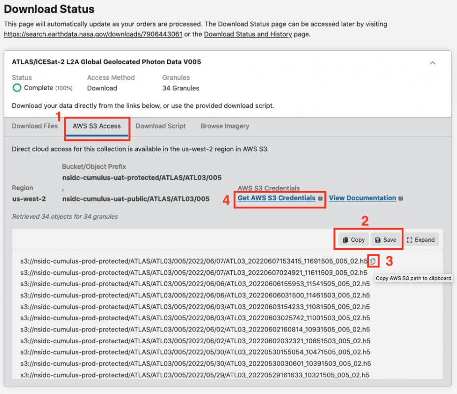

# Using NASA Earthdata Search to Discover Cloud-Hosted Data

## Learning Objective

In this tutorial you will learn how to:

- discover cloud-hosted datasets using NASA Earthdata Search.  
- get AWS S3 credentials so you can access this data
- get the S3 links to data granules

## Prerequisites

- an Earthdata Login

## Overview

NASA Earthdata Search is a web-based tool to discover, filter, visualize and access all of NASA's Earth science data, both in Earthdata Cloud and archived at the NASA DAACs. It is a useful first step in data discovery, especially if you are not sure what data is available for your research problem.

This tutorial is based on the NSIDC [NASA Earthdata Cloud Access Guide](https://nsidc.org/data/user-resources/help-center/nasa-earthdata-cloud-data-access-guide). Take a look at this access guide if you want more information and also to learn how to use command line tools to download cloud-hosted data from an S3 bucket.

## Searching for data and S3 links using Earthdata Search

### Search for Data

Step 1. Go to https://search.earthdata.nasa.gov and log in using your Earthdata Login credentials by clicking on the Earthdata Login button in the top-right corner.

Step 2. Check the **Available in Earthdata Cloud** box in the **Filter Collections** side-bar on the left of the page (Box 1 on the screenshot below).  The Matching Collections will appear in the results box.  All datasets in Earthdata Cloud have a badge showing a cloud symbol and "Earthdata Cloud" next to them.  To narrow the search, we will filter by datasets supported by NSIDC by typing "NSIDC" in the search box (Box 2 on the screen shot below).  If you want, you could narrow the search further using spatial and temporal filters or any of the other filters in the filter collections box.

<figure>

    

</figure>

Step 3. You can now select the dataset you want by clicking on that dataset.  The Search Results box now contains granules that match your search.  The location of these granules is shown on the map.  The search can be refined using spatial and temporal filters or you can select individual granules using the "+" symbol on each granule search result.  Once you have the data you want, click the **Download All** (Box 1 in the screenshot below). In the sidebar that appears, select **Direct Download** (Box 2 in the screenshot below). Then select **Download Data**.

<figure>
    

        
    

</figure>

### Getting S3 links and AWS S3 Credentials

Step 4.  A Download Status window will appear (this may take a short amount of time) similar to the one shown below.  You will see a tab for **AWS S3 Access** (Box 1 in the screenshot below). Select this tab. A list of S3 links (urls) starting with `s3://` will be in the box below.  You can save them to a text file or copy them to your clipboard using the **Save** and **Copy** buttons (Box 2 in the screenshot below). Or you can copy each link separately by hovering over a link and clicking the clipboard icon (Box 3).

Step 5.  To access data in Earthdata Cloud, you need AWS S3 credentials; “accessKeyId”, “secretAccessKey”, and “sessionToken”.  These are temporary credentials that last for one hour.  To get them click on the **Get AWS S3 Credentials** (Box 4 in the screenshot below).   This will open a new page that contains the three credentials.  

<figure>
    

        
    

</figure>
    
### Using links and credentials from the command line

Now that you have the S3 links and credentials you can download the data using the [AWS Command Line Interface (CLI)](https://aws.amazon.com/cli/).  This is shown in the [NASA Earthdata Cloud Access Guide](https://nsidc.org/data/user-resources/help-center/nasa-earthdata-cloud-data-access-guide).

[!IMPORTANT]  
As of writing, the AWS CLI is not installed on CryoCloud. The other modules in this tutorial will show how to search and access data all within a single Jupyter Notebook.
